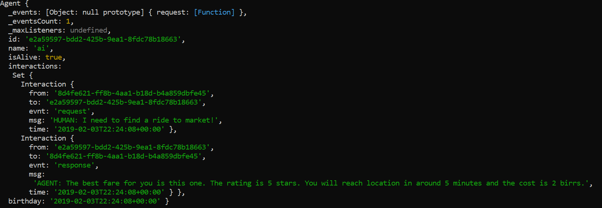
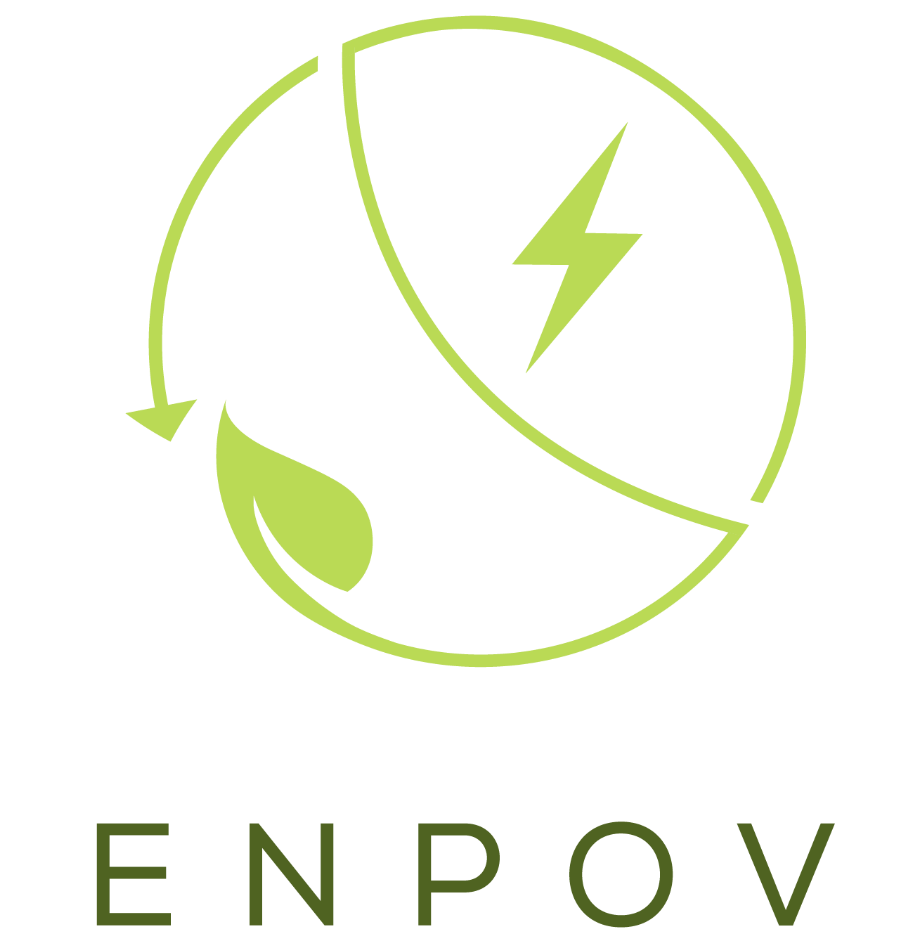

# Modelling decision-making with intelligent agents to assist rural commuters in developing nations.

 
Patricio Julián Gerpe. Evangelos Markopoulos

 

**Abstract:** More than a billion of the rural merchants in the developing world commonly depend on hiring on-demand transportation services to commute people or goods to markets. The process of selecting the optimal fare involves handling decision-making characterised with multiple alternatives and competing criteria. Decision support systems are commonly used to solve these types of problems. However, most widely used systems are based on object-based approaches which lack high-level abstractions needed to effectively model and scale human-machine communication. This paper reviews previous literature on the field and introduces an improved preliminary agent-based decision-support approach to overcome those challenges. As a proof of concept, we developed a two-agent simulation that, given a request from one of the agents, the other one takes a dataset of a stratified sample of 104 Ethiopian commuter criteria preferences taken from the Dukem region and an exemplary dataset of fare alternatives. The assistant agent computes those datasets using widely used HPA and TOPSIS algorithms to weight, score, rank those alternatives. Once we run the simulation, in a matter of milliseconds the assistant agent effectively returns an optimal prescription to the other agent, storing all interactions in a self-contained memory resulting in an architecture that allows developers to program further customisation as interactions scale.

Made with  

## Package Dependencies

-   aopifyjs
-   linear-algebra
-   topsis
-   uuid
-   moment

## License

GNU v3

## Quality Ensurance

### Testing
-   mocha: "mocha": "^5.2.0"
-   chai: "chai": "^4.2.0"
-   Test: `npm run test`

### Coverage
-   nyc: "nyc": "^13.1.0"
-   "coveralls": "^3.0.2"
-   Check coverage: `npm run cover`

### Build check
-  travis

### Linting
-   "eslint": "^5.11.1"
-   Code Style: AIRBNB
[AIRBNB JS CODE STYLE](https://dev.mysql.com/doc/ "AIRBNB JS CODE STYLE")
-   Eslint v-5.11.1 // AIRBNB Configuration
-   Error fix: `npm run lint-fix`
-   Error fix:  `npm run lint` or `npm run lint -- --fix`

## What is ENPOV?

 

Enpov is an Ethiopian UN-awarded social enterprise endorsed by the African Union and the Red Cross, that uses data science, USSD and SMS technologies to connect rural merchants with on-demand transportation to periurban markets in Africa.

Check more in <www.enpov.com>

The project received a certification from former U.S. President **Bill Clinton** after reaching the 'Founder's Circle' in the Hult Prize Competition in 2017/2018 for mading it into the top 20 teams of the world out of around 30,000 projects presented and more than 100,000 participants from 117 countries in that edition.

 

